<div align="center">

# 🔐 Diffie-Hellman Key Exchange Demo

### Interactive Educational Implementation with Man-in-the-Middle Attack Simulation

[](https://opensource.org/licenses/MIT)
[](https://nodejs.org/)
[](https://developer.mozilla.org/en-US/docs/Web/API/WebSockets_API)
[](https://github.com)

```
    Alice                    Eve                      Bob
   (Client)            (Eavesdropper)              (Server)
      |                      |                        |
      |---- Public Key A --->|---- Public Key A ----->|
      |                      |                        |
      |<--- Public Key B ----|<--- Public Key B ------|
      |                      |                        |
      |   🔒 Encrypted Msg ->| 🕵️  INTERCEPTED!       |
      |                      |   ✓ Decrypted          |
      |                      |---- Forwarded -------->|
      |                      |                        |
```

[Features](#-features) • [Quick Start](#-quick-start) • [How It Works](#-how-it-works) • [Architecture](#-architecture) • [Security](#-security-demonstration)

</div>

---

## 📋 Table of Contents

- [Features](#-features)
- [Prerequisites](#-prerequisites)
- [Installation](#-installation)
- [Quick Start](#-quick-start)
- [How It Works](#-how-it-works)
- [Architecture](#-architecture)
- [Security Demonstration](#-security-demonstration)
- [Educational Value](#-educational-value)
- [Technical Details](#-technical-details)
- [Production Considerations](#-production-considerations)
- [License](#-license)

## ✨ Features

- 🎓 **Educational**: Perfect for teaching cryptography and network security concepts
- 🔍 **Man-in-the-Middle Demonstration**: Shows real-time eavesdropping and decryption
- 💬 **Interactive Chat**: Real encrypted communication between two parties
- 📊 **Detailed Logging**: Every step of the key exchange is explained with mathematical formulas
- 🕵️ **Brute Force Attack Simulation**: Watch Eve crack the shared secret in real-time
- 🎯 **WebSocket-Based**: Real network communication, not just simulation
- 📦 **Self-Contained**: No external dependencies beyond Node.js packages

## 🔧 Prerequisites

- **Node.js** >= 14.0.0 or **Bun** >= 1.0.0
- **npm** or **yarn** or **bun**
- 3 terminal windows (for full demonstration with eavesdropper)

## 📥 Installation

```bash
# Clone the repository
git clone <your-repo-url>
cd diffie-hellman-demo

# Install dependencies
npm install
# or
bun install
```

## 🚀 Quick Start

### Option 1: With Eavesdropper (Recommended for Teaching)

Open **3 terminal windows** and run in this **exact order**:

#### Terminal 1️⃣ - Start Bob (Server)
```bash
npm run bob
```
✓ Wait for: `🟢 Bob's server listening on port 8080`

#### Terminal 2️⃣ - Start Eve (Eavesdropper)
```bash
npm run eve
```
✓ Wait for: `✅ Eve connected to Bob!`

#### Terminal 3️⃣ - Start Alice (Client)
```bash
npm run alice
```
✓ Now chat and watch Eve intercept everything! 🕵️

### Option 2: Direct Connection (Without Eavesdropper)

#### Terminal 1️⃣ - Start Bob
```bash
npm run bob
```

#### Terminal 2️⃣ - Start Alice
```bash
npm run alice
```

Alice will automatically connect directly to Bob when Eve is not running.

## 🔍 How It Works

### The Diffie-Hellman Protocol

```
1. Public Parameters (known to everyone)
   ├── Prime number (p): 23
   └── Generator (g): 5

2. Alice generates private key (a)
   └── Computes public key: A = g^a mod p

3. Bob generates private key (b)
   └── Computes public key: B = g^b mod p

4. Exchange public keys (A ↔ B)

5. Both compute shared secret
   ├── Alice: s = B^a mod p
   └── Bob: s = A^b mod p
   
6. Result: Both have same secret! ✨
```

### With Eve (Man-in-the-Middle)

```mermaid
sequenceDiagram
    participant Alice
    participant Eve
    participant Bob
    
    Note over Alice,Bob: Public Parameters: p=23, g=5
    
    Alice->>Eve: Public Key A
    Eve->>Bob: Forward A
    Note over Eve: 🕵️ Intercepts A
    
    Bob->>Eve: Public Key B
    Eve->>Alice: Forward B
    Note over Eve: 🕵️ Intercepts B
    
    Note over Eve: 🔨 Brute Force Attack
    Note over Eve: ✓ Cracked Secret!
    
    Alice->>Eve: 🔒 Encrypted Message
    Note over Eve: 🔓 DECRYPTED!
    Eve->>Bob: Forward Message
    
    Bob->>Eve: 🔒 Encrypted Reply
    Note over Eve: 🔓 DECRYPTED!
    Eve->>Alice: Forward Reply
```



## 🏗️ Architecture

```
diffie-hellman-demo/
├── 📦 package.json          # Project configuration
├── 📖 README.md             # This file
├── 📂 shared/
│   └── crypto.js            # Cryptographic functions (modPow, encrypt, decrypt)
├── 📂 alice/
│   └── alice.js             # Alice's client application (port 8081 → 8080)
├── 📂 bob/
│   └── bob.js               # Bob's server application (port 8080)
└── 📂 eve/
    └── eve.js               # Eve's proxy server (port 8081, connects to 8080)
```

### Component Responsibilities

| Component | Role | Port | Description |
|-----------|------|------|-------------|
| **Bob** 🔵 | Server | 8080 | Accepts connections and initiates key exchange |
| **Alice** 🔴 | Client | - | Connects to server (via Eve if available) |
| **Eve** 🟡 | Proxy | 8081 | Intercepts traffic and attempts to decrypt |

## 🛡️ Security Demonstration

### What Eve Can See (Public Information)
```javascript
✓ Prime (p): 23
✓ Generator (g): 5
✓ Alice's public key (A): [intercepted]
✓ Bob's public key (B): [intercepted]
✓ All encrypted messages
```

### What Eve Cannot See (Private Information)
```javascript
✗ Alice's private key (a): [never transmitted]
✗ Bob's private key (b): [never transmitted]
✗ Shared secret (s): [computed independently]
```

### Eve's Attack Strategy

1. **Intercept**: Capture all public keys
2. **Brute Force**: Try all possible private keys (1 to p-1)
3. **Verify**: Check if g^guess mod p == intercepted_public_key
4. **Decrypt**: Use found private key to compute shared secret
5. **Result**: With p=23, Eve succeeds in milliseconds! ⚠️

### Example Terminal Output

```bash
🔨 EVE ATTEMPTING TO CRACK THE SHARED SECRET...

Strategy: Brute force attack on private keys
Known values: p=23, g=5, A=21, B=2

Trying to find Alice's private key (a):
✓ Found Alice's private key: a = 13 (after 13 attempts in 0ms)

🎯 EVE CRACKED THE SHARED SECRET: 4
   Calculated as: B^a mod p = 2^13 mod 23 = 4

⚠️  SECURITY NOTE:
   With small numbers (p=23), brute force is feasible.
   With real-world parameters (2048+ bit primes),
   this would take billions of years!

📨 INTERCEPTED from Alice → Bob:
   Type: encrypted_message
   🔒 Encrypted data: QVU=...
   🔓 EVE SUCCESSFULLY DECRYPTED: "Hello Bob!"
   ⚠️  Alice and Bob think their conversation is private!
```

## 🎓 Educational Value

This demo teaches:

### 1. **Diffie-Hellman Protocol**
- How public key exchange works
- Mathematical foundations (modular arithmetic)
- Why the discrete logarithm problem is hard

### 2. **Network Security Concepts**
- Man-in-the-middle attacks
- The importance of key size
- Public vs. private information

### 3. **Cryptographic Principles**
- Forward secrecy
- Why authentication is needed (DH doesn't provide it!)
- Computational complexity

### 4. **Real-World Applications**
- TLS/SSL handshakes
- VPN key exchange
- Secure messaging protocols

## 🔬 Technical Details

### Cryptographic Functions

```javascript
// Modular exponentiation: (base^exp) mod modulus
modPow(base, exp, modulus)

// Public key generation
publicKey = g^privateKey mod p

// Shared secret computation
sharedSecret = otherPublicKey^privateKey mod p

// Simple XOR encryption (for demonstration only!)
encrypted = XOR(message, sharedSecret)
```

### Protocol Flow

```
Phase 1: Connection Establishment
├── Bob starts WebSocket server (8080)
├── Eve starts proxy server (8081) and connects to Bob
└── Alice connects to Eve (8081)

Phase 2: Key Exchange
├── Alice sends public key A to Eve
├── Eve forwards to Bob (and stores A)
├── Bob sends public key B to Eve
└── Eve forwards to Alice (and stores B)

Phase 3: Attack
├── Eve attempts brute force on private keys
├── Eve computes shared secret
└── Eve can now decrypt all messages

Phase 4: Communication
├── Alice/Bob exchange encrypted messages
├── Eve intercepts and decrypts everything
└── Messages forwarded transparently
```

## ⚠️ Production Considerations

### This Demo Uses Small Numbers for Education

| Parameter | Demo Value | Production Value |
|-----------|------------|------------------|
| Prime (p) | 23 | 2048-4096 bits |
| Private keys | 2-22 | 256+ bits |
| Cracking time | ~0ms | Billions of years |

### What's Missing for Production?

- ❌ **Authentication**: No way to verify identities (vulnerable to MITM)
- ❌ **Secure Primes**: Use safe primes and verified generators
- ❌ **Key Derivation**: Use KDF (like HKDF) instead of direct encryption
- ❌ **Forward Secrecy**: Use ephemeral keys (DHE/ECDHE)
- ❌ **Real Encryption**: Replace XOR with AES-GCM or ChaCha20-Poly1305

### Recommended Improvements for Real Use

```javascript
// Use crypto library for secure random numbers
import { randomBytes } from 'crypto';

// Use safe primes (Sophie Germain primes)
const safePrimes = {
  2048: "0xFFFFFFFFFFFFFFFFC90FDAA22168C234C4C6628B80DC1CD1...",
  3072: "0xFFFFFFFFFFFFFFFFC90FDAA22168C234C4C6628B80DC1CD1...",
  4096: "0xFFFFFFFFFFFFFFFFC90FDAA22168C234C4C6628B80DC1CD1..."
};

// Use established protocols
// - TLS 1.3 for transport security
// - Signal Protocol for messaging
// - WireGuard for VPNs
```

## 📚 Additional Resources

- [RFC 2631 - Diffie-Hellman Key Agreement](https://tools.ietf.org/html/rfc2631)
- [The Mathematics of Diffie-Hellman](https://en.wikipedia.org/wiki/Diffie%E2%80%93Hellman_key_exchange)
- [Discrete Logarithm Problem](https://en.wikipedia.org/wiki/Discrete_logarithm)
- [Understanding Cryptography](https://www.crypto-textbook.com/)

## 📝 License

MIT License - feel free to use this for educational purposes!

## 🤝 Contributing

Contributions are welcome! Some ideas:

- [ ] Add visual web interface
- [ ] Implement elliptic curve DH (ECDH)
- [ ] Add timing attack demonstrations
- [ ] Create Jupyter notebook with visualizations
- [ ] Add support for larger prime numbers

---

<div align="center">

**Made with ❤️ for cryptography education**

</div>